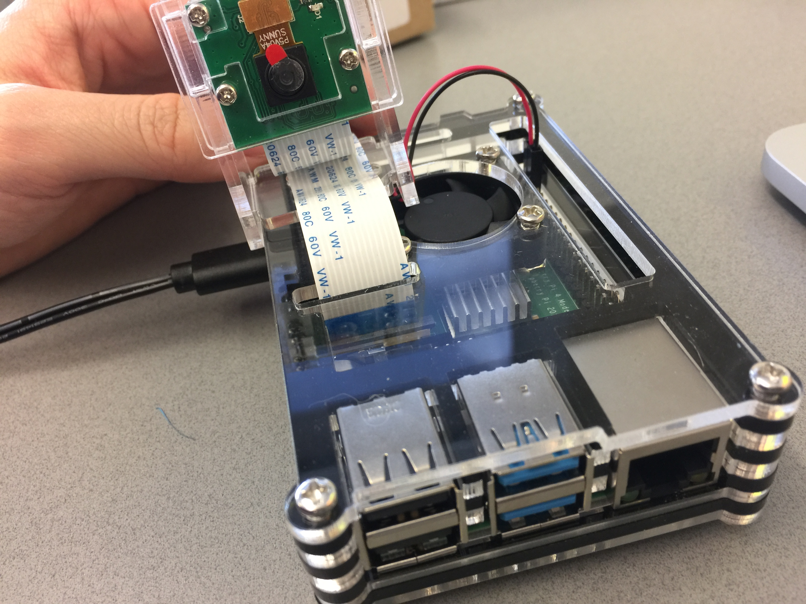
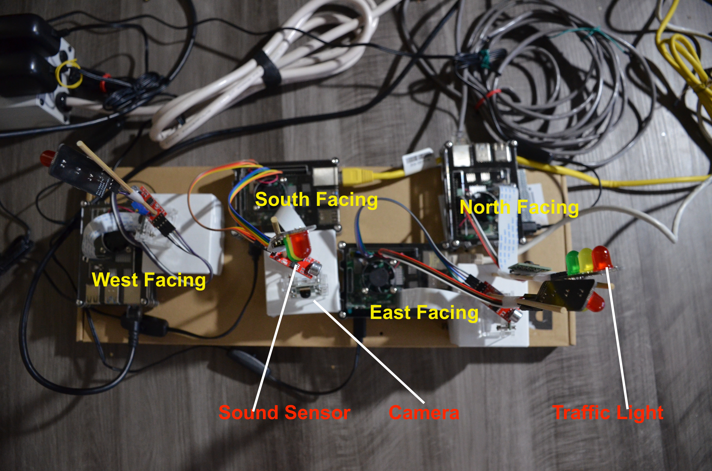
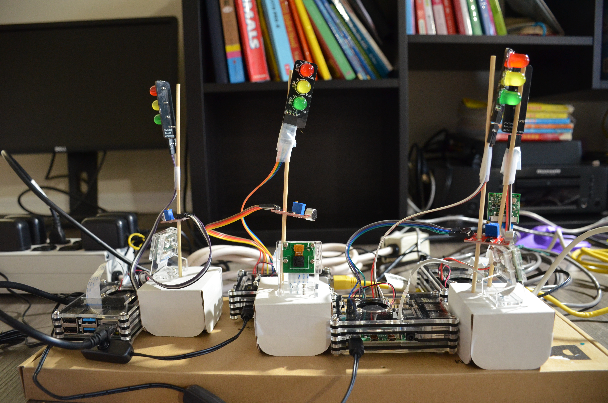
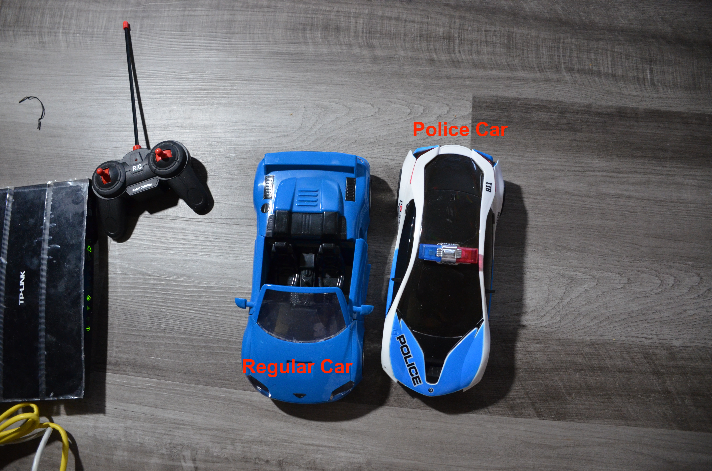

  
  
  
  Figure 1. Installed the cooling box with raspberry pi and camera stand for the camera.  

  
  
  
  Figure 2. Installed the traffic light system. Four raspberry pi, four cameras, four traffic lights, three sound sensors. 

  
  
  
  Figure 3. Front view of the installed system. Each module is fully functional. Camera can detect moving car using tensorflow lite. Sound sensor can detect siren using python code. Traffic light can switch among regular, flashing and emergency mode using python code.

  
  
  
  Figure 4. The cars used in this project. Unfortunately, the siren of the police car cannot turn off, so the use case that police car not on duty will not be available.  

  
  
  
  Figure 5. Use SSH or use microsoft remote desktop to access the four raspberry pis. Currently looking for ways that raspberry pi as a client communicate with the server (might be a computer).

