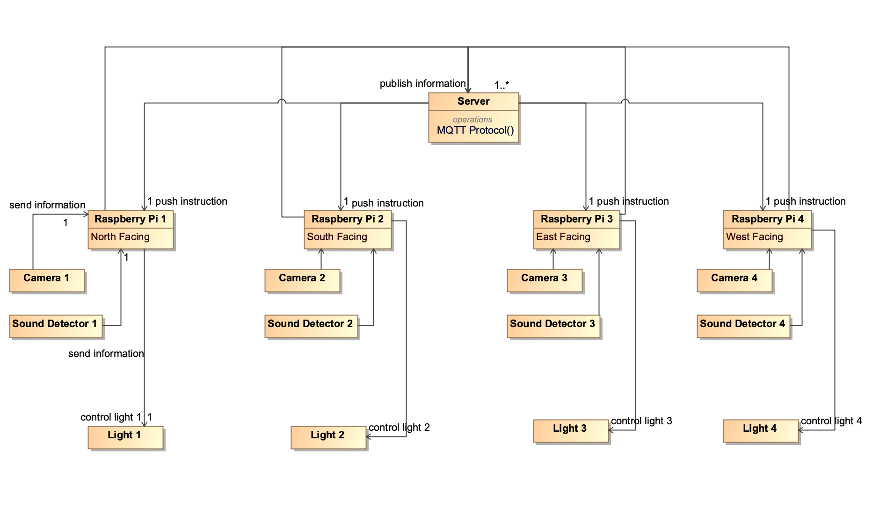
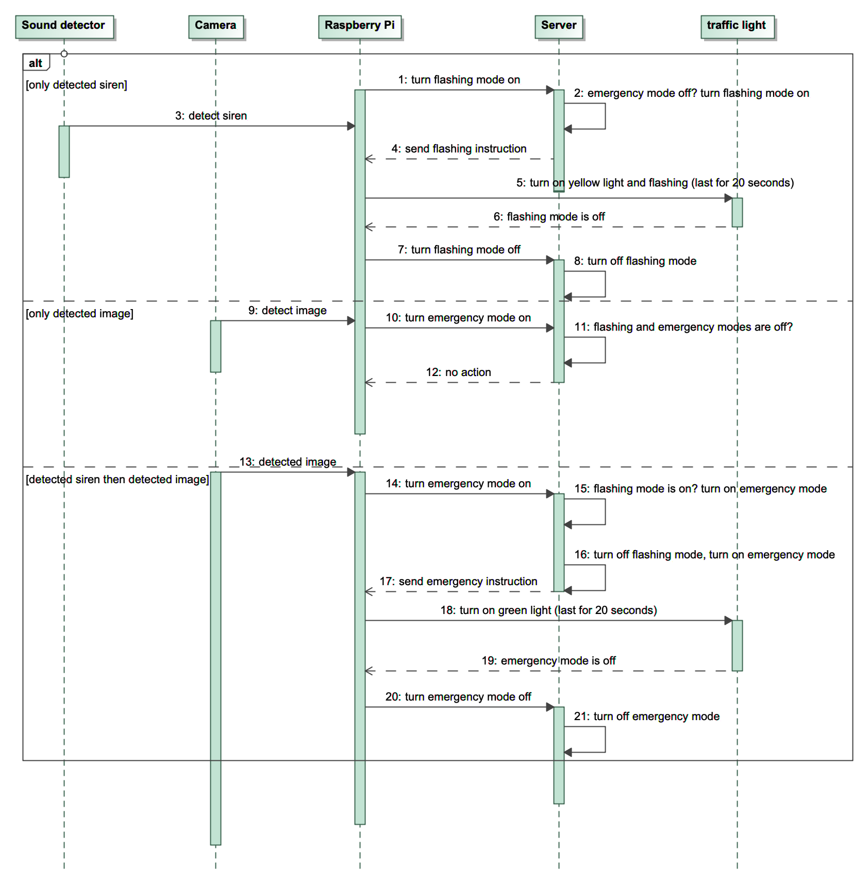

# Project work distribution & timeline
Huachuan Wang, Cuidi Wei, Andrew Nguyen

## Brief project description
While emergency vehicles speed up to save lives, they put themselves in a dangerous condition. We plan to develop a smart traffic light system to guarantee the safety of the emergency vehicles. When emergency vehicles pass a crossroad, the sensors of traffic light know and send the message to the cloud so that the cloud controls the traffic lights to let emergency vehicles pass the traffic light at a higher speed.

## Components breakdown

### Sensor
*Camera*. 
A camera is to detect the motion of the emergency vehicles.

*Sound detector*. 
A sound detector is able to perform detection of siren sounds. 

### Computing capabilities
*Raspberry Pi*. 
A raspberry pi is connected to wifi, it receives the data from camera and sound detector and sends the information to the cloud. 

*Cloud*. 
The cloud processes the data received from the raspberry pi. The sound and image information is processed and the cloud generates instructions to the rasberry pi accordingly. 

*Broker*. 
We use a broker to collect all of data received from cameras and sound sensors. By using broker, it's convenient for the cloud to control traffic lights at the same time.

### Actuator
*Traffic lights*. 
The cloud sends instructions to raspberry pi. Raspberry pi controls the traffic light depending on the cloud instructions. The traffic light can be turned on, off or flashing.

### Connections
The camera, sound detector and traffic lights are conncected to the raspberry pi. A raspberry pi is connected to the wifi and cloud.

### Interfaces
*Sound Detection*
Monitor the ambulance's sound and notify the camera to detect whether an ambulance is in the road.

*Image Processing*
Check if an ambulance is in a picture so that it will know whether an ambulance is in the current road. In this module, Tensorflow is used and the helpful code is in the code directory.

*Computing I: Check ambulance's moving direction*
When an ambulance rings, the nearby sound sensors will detect. So we need to check the ambulance's moving direction in order to only change the traffic lights to green in its direction. Some helpful code is in the Tensorflow module.

*Computing II: Identify ambulance's sound*
A sound sensor will receive many many various sounds, so the Siren Detection API is important to check if it is ambulance's sound. The helpful code is also attached in the code directory.

*Computing III: Control Traffic lights*
In the road, there are only traffic lights which an ambulance will pass to get the front pictures of the ambulance. So the traffic light that detects the existence of an ambulance will send messages to the cloud. After getting the message from the traffic lights, the cloud will control the other traffic light in the crossroad to red to guarantee that other cars will make a way for the ambulance. The code will be developed by us later.

### Security
Security often focusses on the very interesting vulnerabilities and exploits, but there is usually less focus on common misconfigurations or bad implementations. A misconfiguration such as a simple or default password, an insecure API, or a poorly implemented and unpatched hypervisor can also lead to a security compromise. The best method to deal with these misconfigurations is to have proper Change Control systems in place, to include Security experts in the review panel, and to have robust, secure configuration standards in place. However, in our environment, it is efficient for us to configure correctly and prevent attacks due to misconfigurations.

DDoS attacks will crash the cloud to prevent the cloud from working regularly. Therefore, it is crucial to prevent DDoS attacks for the cloud to make sure the traffic lights can work. To achieve this, setting up specific rules to filter out illegal attacks is a necessary step.

  
  Figure 1. Device connection model. Four raspberry pis each connected with a camera, a sound detector and a traffic light. Pi process the image and sound detection. Pi then send singles to the cloud. Clound send instruction back to Pi to control the traffic light.

  
  Figure 2. Demo setup. Each camera detect the emergency vehicle in one direction. 

  
  Figure 3. Sequence diagram. Flashing mode is on when the sound detector detects the siren, the corresponding traffic lights will turn yellow and flashing. Emergency mode is on when both sound and image of the emergency vehicle are detected, the corresponding traffic lights will turn green to let the emergency vehicle to go through, other traffic lights will turn red.

|          | Timeline                                                    |
|----------|-------------------------------------------------------------|
|2.13-2.20 |Planning with logistics and specifications in order to provide sufficient and efficient properties |
|          |Proper work distribution                                     |
|2.20      |Checkpoint 1|
|2.20-2.27 |Proceed work with constructive criticism and recommendations|
||Allocate proper costs and necessities for the Project|
|2.20-2.27|Proceed work with constructive criticism and recommendations|
||Allocate proper costs and necessities for the Project|
|2.27-3.6|Continue working along with applying the sound detection along with the light|
||Camera Should have substantial progress|
|3.6-3.24|Cloud Control should be working to some degree|
||Majority of Components should be working together|
||Sound and Traffic Light should have substantial progress|
|3.24|Checkpoint 2|
|3.24-3.31|Continue working with the criticism and feedback|
||Camera, Light, and Sound should be completed|
||Cloud Control should have progress|
||Ensurance that everything is running smoothly|
|3.31-4.20|Work on presentations and write-ups|
||Finalizations & debuggings on the design/project|
|4.21-4.23|Final presentations and Demo|
